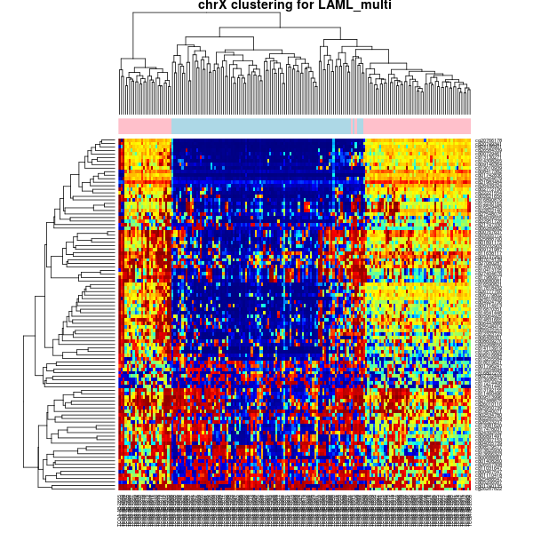
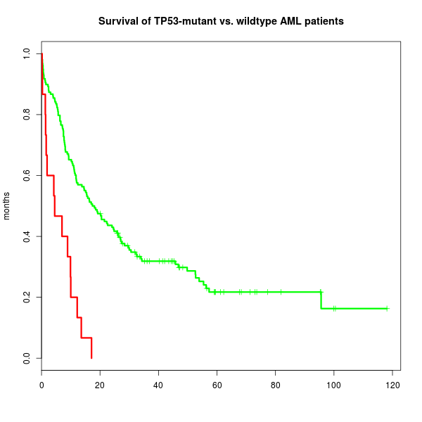
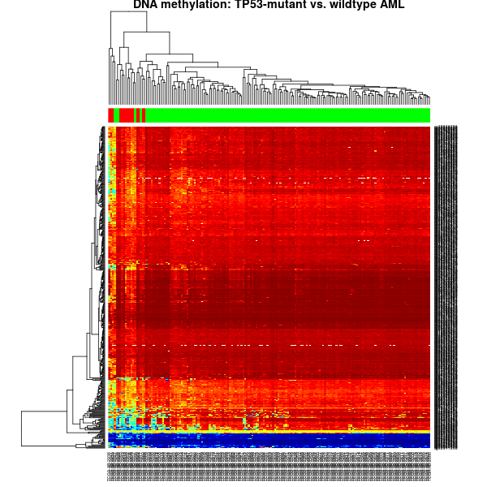
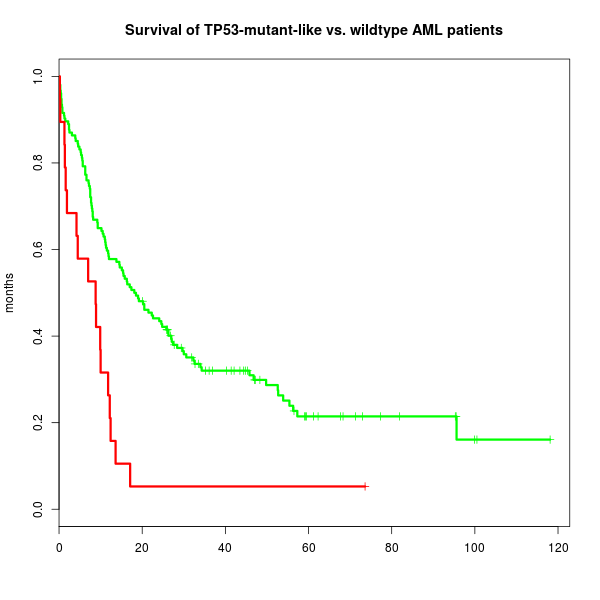
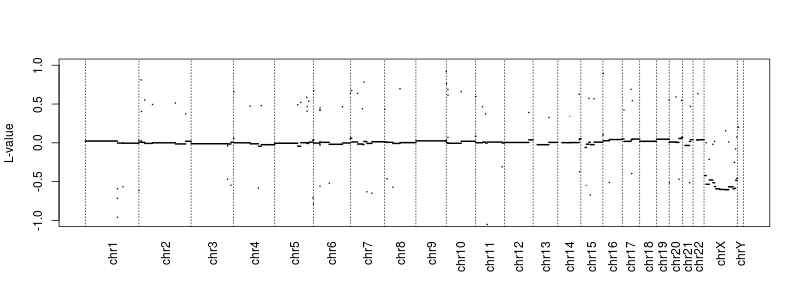
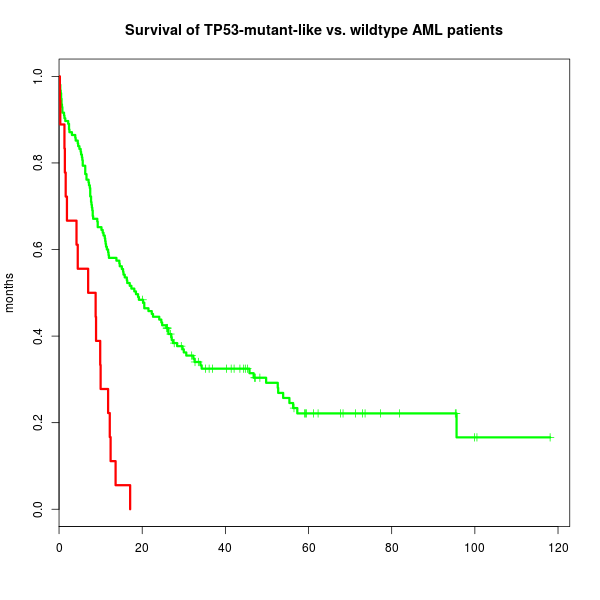
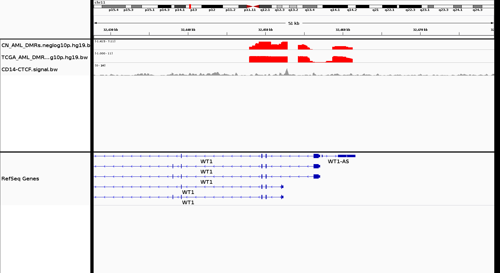
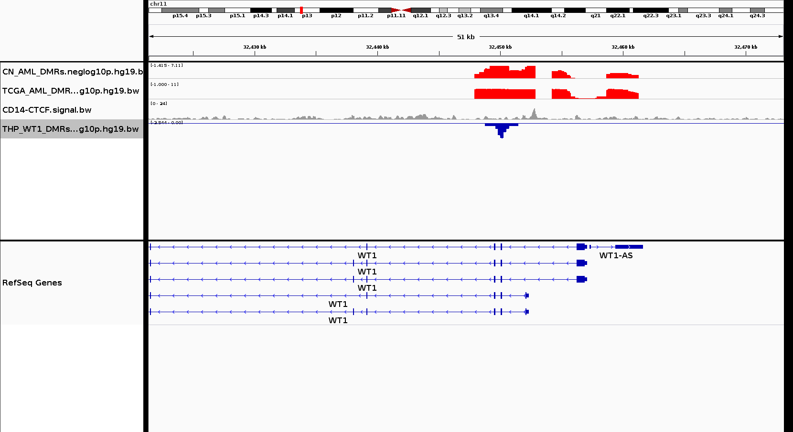

```{r}
library(bioc2015multiomicsworkshop) ## pulls in ozymandias 
```

# Overview

Hopefully, one of the outcomes of this year's conference will be more elegant 
approaches to doing this, so that similar datasets in the future can be lazily
evaluated for data relevant to a given query. The QC and visualization steps 
are unlikely to become any less relevant, however.  The multiset used here is 
structured as a "master" container where all of the linked assays must have 
the same column names as the master, and the subset operation preserves this.

```{r}
## integrity-preserving subset operation for MultiAssayExperiment
setMethod("[", c("MultiAssayExperiment", "ANY", "ANY"),
          function(x, i, j, ..., drop=TRUE) {
            ## Only if perSampleMetadata isn't empty and j is set
            if (!missing(j) && length(x@perSampleMetadata) > 0) {
              x@perSampleMetadata <- lapply(x@perSampleMetadata,
                                            function(z) z[,j])
            }
            callNextMethod()
          })

## example from package:
data(LAML_multi)
```
# TCGA AML, from raw data & Synapse mutations
```{r}
LAML_multi
```
```
class: MultiAssayExperiment 
dim: 485512 173 
metadata(0):
assays(1): Beta
rownames(485512): cg13869341 cg14008030 ... cg08265308 cg14273923
rowRanges metadata column names(0):
colnames(173): TCGA-AB-2811 TCGA-AB-2973 ... TCGA-AB-2833 TCGA-AB-2971
colData names(18): Tissue Study_Group ... exprRisk UPN
perSampleMetadata: SNPs affy drivers CNV 
  colnames(perSampleMetadata(SNPs)):  TCGA-AB-2811 ... TCGA-AB-2971 
  colnames(perSampleMetadata(affy)):  TCGA-AB-2811 ... TCGA-AB-2971 
  colnames(perSampleMetadata(drivers)):  TCGA-AB-2811 ... TCGA-AB-2971 
  colnames(perSampleMetadata(CNV)):  TCGA-AB-2811 ... TCGA-AB-2971 
```
```{r}
LAML_multi[, 1:10] 
```
```
class: MultiAssayExperiment 
dim: 485512 10 
metadata(0):
assays(1): Beta
rownames(485512): cg13869341 cg14008030 ... cg08265308 cg14273923
rowRanges metadata column names(0):
colnames(10): TCGA-AB-2811 TCGA-AB-2973 ... TCGA-AB-2832 TCGA-AB-2847
colData names(18): Tissue Study_Group ... exprRisk UPN
perSampleMetadata: SNPs affy drivers CNV 
  colnames(perSampleMetadata(SNPs)):  TCGA-AB-2811 ... TCGA-AB-2847 
  colnames(perSampleMetadata(affy)):  TCGA-AB-2811 ... TCGA-AB-2847 
  colnames(perSampleMetadata(drivers)):  TCGA-AB-2811 ... TCGA-AB-2847 
  colnames(perSampleMetadata(CNV)):  TCGA-AB-2811 ... TCGA-AB-2847 
```

See https://www.synapse.org/#!Synapse:syn1710680 for the per-tumor "cleaned" 
mutations used here.  
The raw MAFs from FireHose releases can be messy. 

```{r, eval=FALSE}
## check gender matches that specified in clinical:
library(ozymandias)
plotX(LAML_multi)

## save a copy too
png(filename="plotX.png", 600, 600)
plotX(LAML_multi)
dev.off()
```
 


```{r, eval=FALSE}
## Fit overall survival with TP53 point mutations
library(survival)
p53mutant <- LAML_multi@perSampleMetadata$drivers['TP53',]
cox <- with(as(colData(LAML_multi), "data.frame"),
            coxph(Surv(OS, OSevent) ~ p53mutant))
png("p53.survival.png", 600, 600)
plot(with(as(colData(LAML_multi), "data.frame"),
             survfit(Surv(OS, OSevent) ~ p53mutant)),
          col=c("green","red"), lwd=3, ylab="months",
          main="Survival of TP53-mutant vs. wildtype AML patients")
dev.off()
```
 

```{r, eval=FALSE}
## what discriminates TP53 mutants best?
library(matrixStats)
autosomeBetas <- function(x) {
  assays(keepSeqlevels(LAML_multi, paste0("chr", 1:22)))$Beta
}
library(limma)
design <- model.matrix(~ p53mutant)
fit <- eBayes(lmFit(autosomeBetas(LAML_multi), design))
top <- rownames(topTable(fit, coef=2, n=500))
```

Depending on how you go about this (plotting the CNV data in perSampleMetadata
to verify which of the p53-like patients was in fact p53-deleted is what we did)
it can be more or less reliable.  As with any QC it helps to look at the data. 

```{r, eval=FALSE}
## flag TP53 mutants, look for any phenocopies
colside <- c("green","red")[p53mutant + 1] 
jet <- colorRampPalette(c("#00007F", "blue", "#007FFF", "cyan",
                          "#7FFF7F", "yellow", "#FF7F00", "red", "#7F0000"))
png("p53.heatmap.png", 600, 600)
dend <- heatmap(autosomeBetas(LAML_multi)[top, ], 
                col=jet(255), scale="none", ColSideColors=colside, 
                main=paste("DNA methylation: TP53-mutant vs. wildtype AML"),
                keep.dendro=TRUE)$Colv
dev.off()
```
 


```{r, eval=FALSE}
## Identify TP53-deleted patients who were not initially flagged as TP53-mutant
p53like <- cutree(tree=as.hclust(dend), k=3)[colnames(LAML_multi)]
colside2 <- c("green","red","red")[p53like] 
png("p53like.heatmap.png", 600, 600)
heatmap(autosomeBetas(LAML_multi)[top, ], 
                col=jet(255), scale="none", ColSideColors=colside2, 
                main=paste("DNA methylation: TP53-mutant-like vs. wildtype AML"))
dev.off()
```
 


```{r, eval=FALSE}
## Fit overall survival again
p53copy <- p53like > 1 | p53mutant
cox <- with(as(colData(LAML_multi), "data.frame"),
            coxph(Surv(OS, OSevent) ~ p53copy))
png("p53like.survival.png", 600, 600)
plot(with(as(colData(LAML_multi), "data.frame"),
             survfit(Surv(OS, OSevent) ~ p53copy)),
          col=c("green","red"), lwd=3, ylab="months",
          main="Survival of TP53-mutant-like vs. wildtype AML patients")
dev.off()
```
 

There's at least one guy who seems like he might not belong.  Let's investigate.

```{r, eval=FALSE}
## check this person's CN at 17p (survival is radically different)
maybeOutlier <- names(which(p53copy)[ which.max(LAML_multi$OS[p53copy]) ])
maybeOutlier <- which(colnames(LAML_multi) == maybeOutlier)

## look at his copy number calls
png("outlierCNV.png", height=300, width=800)
plotSample(perSampleMetadata(LAML_multi)$CNV, maybeOutlier, ylim=c(-1, 1))
dev.off()
```
 

```{r, eval=FALSE}
LAML_multi$predictedSex[maybeOutlier] ## "M"
p53mutant[maybeOutlier] ## FALSE 

## Looks like that was a miscall 
p53copy[maybeOutlier] <- FALSE 

## Fit overall survival again
cox <- with(as(colData(LAML_multi), "data.frame"),
            coxph(Surv(OS, OSevent) ~ p53copy))

png("p53like.survival.revised.png", 600, 600)
plot(with(as(colData(LAML_multi), "data.frame"),
             survfit(Surv(OS, OSevent) ~ p53copy)),
          col=c("green","red"), lwd=3, ylab="months",
          main="Survival of TP53-mutant-like vs. wildtype AML patients")
dev.off()

## 
rm(LAML_multi)
gc(,T) ## free up some RAM
```


Lather, rinse, repeat as necessary (and CAFE will correlate CN with expression).

# IGV from within R 

IGV is terrific for plotting your data interactively and poking at it.  It's 
also fairly straightforward to pull in data from remote sites (just like in R).
If you get tired of IGV mangling your session.xml files, or just want to 
create and export data on the fly, R can help with that.  In this example, we 
had generated smoothed Manhattan plots of differentially methylated regions 
associated with acute myeloid leukemia of normal karyotype, and a point about
CTCF binding sites was raised.  In the process we discovered something we needed
to tune in the algorithm, and verified that a separate result was unaffected.

```{r, eval=FALSE}

library(SRAdb) ## for IGV 
startIGV()
sock <- IGVsocket()
pubUrl <- "https://dl.dropboxusercontent.com/u/12962689/bigWigs/"
getBwUrl <- function(x) paste0(pubUrl, x)

## switch to hg19 
IGVclear(sock)
IGVgenome(sock, "hg19")
IGVgoto(sock, "WT1")

## AML-specific DMRs don't SEEM to cross the CTCF site at first, but...
IGVload(sock, getBwUrl("CN_AML_DMRs.neglog10p.hg19.bw"))
IGVload(sock, getBwUrl("TCGA_AML_DMRs.neglog10p.hg19.bw"))
IGVload(sock, getBwUrl("CD14-CTCF.signal.bw"))
IGVgoto(sock, "chr11:32,427,807-32,479,566")
IGVsnapshot(sock, "AML.CTCF.DMR.check.png")
## clearly we need to increase the smoothing parameter a little bit
```
 

```{r, eval=FALSE}
## We were mostly interested in the effect of WT1 itself being mutated:
IGVload(sock, getBwUrl("THP_WT1_DMRs.neglog10p.hg19.bw"))
IGVsnapshot(sock, "WT1.CTCF.DMR.check.png")
## That, at least, doesn't seem to be driven by CTCF. 
```
 

So that resolved a discussion we were having on Monday about the poster!
